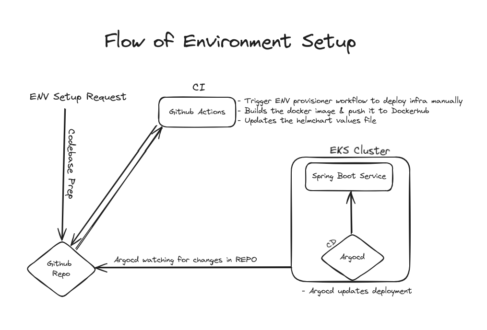
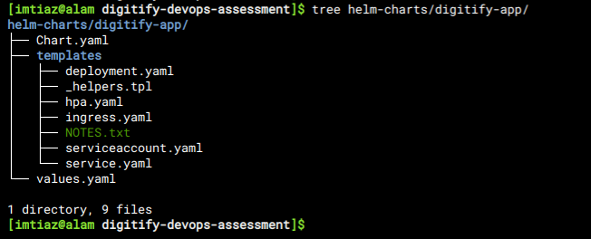
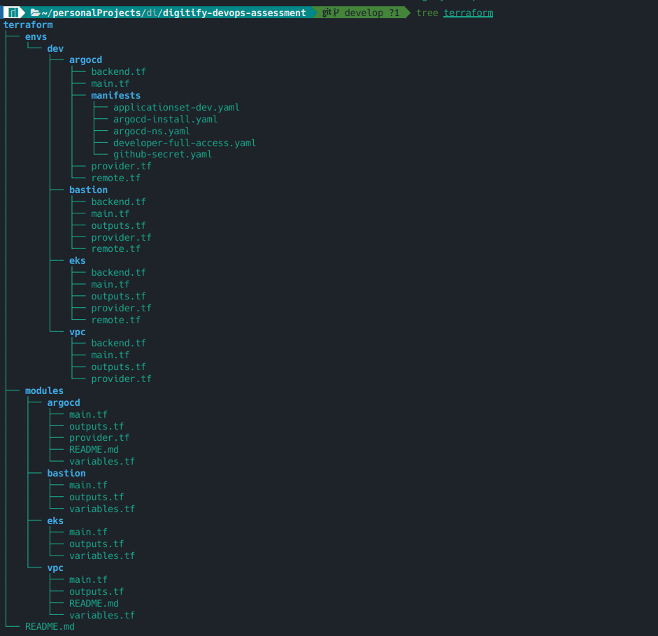

# Digitify DevOps Assessment

## Introduction

This report explains the approach and decisions made throughout the
implementation of the assessment, as well as the challenges encountered
during the process.

The following flow chart diagram depicts the overall solution.

## Web Application Setup

I created a basic Java web application using start.spring.io,
incorporating the Spring Web module. I selected the Spring Web module
because it includes an embedded Tomcat server, making it straightforward
to package the app into an image and serve it with minimal additional
effort.

# 

## Dockerfile

The Dockerfile builds a containerized Java application using OpenJDK 17,
copies the compiled JAR file, and runs it on port 8080, with the image
hosted on a public DockerHub repository.

### Build & Push Commands:

-   **Build**: docker build -t imtiaz1519/digitify-sprint-boot:1.0.0 .\
    > Builds the Docker image with version 1.0.0.

-   **Push**: docker push imtiaz1519/digitify-sprint-boot:1.0.0\
    > Pushes the built image to DockerHub for public access.

## Helmchart

I've developed a Helm chart to deploy the Spring Boot application on an
EKS cluster. The chart includes a Deployment, Service, Ingress,
Horizontal Pod Autoscaler (HPA), and ServiceAccount. The values file has
been customized to provide environment variables, ensuring the
application is properly configured and deployed on the EKS cluster.

It is present at ***helmcharts/digitify-app*** in the root directory of
the repository.

# 

### Bash Script

Created a bash script that deploys the helm chart into any EKS cluster

## Terraform

### Pre-requisites

***NOTE:** Before running these terraform scripts, one must have enough
knowledge of **AWS, Terraform,** and **Kubernetes**.*

1.  #### S3 bucket
    > Create an S3 bucket with the name
    > digitify-terraform-state-bucket. This bucket will be used as a
    > terraform remote state backend, and it is a one-time effort.

2.  #### Dynamodb table
    > Note: This will beb used for terraform **State Locking.** Create
    > a table digitify-dynamodb-terraform-state-lock. You can create a
    > separate table for other environments.

3.  #### AWS IAM User
    > We need to create an IAM user for terraform that have service
    > specific permissions to provision infrastructure resources.

4.  #### AWS User Profile
    > Update your aws config (\~/.aws/config) and credentials
    > (\~/.aws/credentials) files on your machine to add a profile with
    > named devops.

### Resource Naming Convention

> \<business-unit\>-\<env\>-\<resource-name\>-\<optional-identifier\>

1.  **Business Unit:** The name of *company/business-unit/team/org* that
    > is creating a resource

2.  **ENV:** The name of the environment e.g: dev, qa, stage, prod, test

3.  **Resource Name:** The name of the actual resource being created
    > e.g.: eks cluster, bastion host, postgres instance, redshift
    > cluster.

4.  **Optional Identifier:** Any additional name that describes the
    > additional details for which resource is being created e.g. for
    > testing, a resource is in multi-az, standalone, internal for the
    > team, shared b/w environments, etc.

### Terraform Directory Structure

I\'ve implemented a modular approach to designing the infrastructure.
The **modules** directory houses all the core modules like argocd, eks,
bastion, and vpc, each encapsulating its respective infrastructure
logic. These modules are then utilized in the **env** directory, which
contains environment-specific folders such as dev. Each environment
folder, like dev, calls these core modules for that particular
environment.

This approach simplifies the infrastructure code and provides the
advantage of managing state files for each component separately,
ensuring modularity and easier management.

## CI/CD

### CI via GitHub Actions

I\'ve implemented **GitHub Actions** as the CI solution, with several
workflow files:

1.  **main-workflow.yaml**: Monitors pushes to the dev or main branches
    > and invokes changes.yaml to determine which directories have been
    > modified.

2.  **changes.yaml**: Identifies folder changes and returns the result
    > to main-workflow.yaml.

3.  **reusable.yaml**: Accepts parameters, builds the Docker image,
    > pushes it to DockerHub, and updates the Helm chart. Once the Helm
    > chart is updated, it pushes the changes back to the GitHub
    > repository. The main-workflow.yaml workflow triggers this file.

To provision or de-provision an environment, the **.github/workflows**
directory contains two additional files:

1.  **env-provisioner.yaml**: This workflow is triggered manually to set
    > up the environment infrastructure. It calls the vpc, bastion, eks,
    > and argocd modules to provision the environment\'s infrastructure.

2.  **env-destroyer.yaml**: This workflow is responsible for tearing
    > down the environment. It calls the modules in reverse order to
    > destroy the infrastructure.

### CD via Argocd

We chose to implement GitOps for our continuous deployment and delivery
processes, using ArgoCD. This tool is deployed within our EKS cluster
and monitors changes in our Helm charts. Whenever a Helm chart is
updated, ArgoCD detects the changes, pulls them, and redeploys them to
the EKS cluster.
